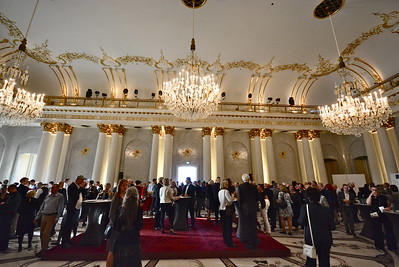

* Ort: [Potsdam - Bürgerhaus am Schlaatz, Schilfhof 28, 14478 Potsdam](https://www.openstreetmap.org/?mlat=52.37749&mlon=13.09729#map=19/52.37749/13.09729)
* Datum: Montag, 12.01.2026 10:00 - 15:00
* Wer: ÖGD-Brandenburg-Berlin-Mitglieder und Interessierte 

 

## Einladung
Liebe Kolleginnen und Kollegen,
in diesem Jahr haben wir ein vielseitiges Programm zusammengestellt, das verschiedene Themenfelder des Öffentlichen Gesundheitsdienstes abdeckt.
Wir hoffen, dass für alle Teilnehmenden interessante und relevante Inhalte dabei sind. Bis demnächst in Potsdam

_Dr. Katharina Krause_

## Fortbildung
für Mitarbeiterinnen und Mitarbeiter der Gesundheitsämter in Brandenburg und Berlin

**10:00 bis 10:05 Uhr**  
Dr. Katharina Krause  
Begrüßung und Einführung  

**10:05 bis 10:15 Uhr**  
Venio Piero Quinque - Präsident des Landesamtes für Arbeitsschutz, Verbraucherschutz und Gesundheit des Landes Brandenburg  
Grußwort  

**10:15 bis 10:45 Uhr**   
Dr. Ariane Walz   
„Klimaanpassungsgesetz und mögliche Aufgaben für die Gesundheitsämter“  

**10:45 bis 11:30 Uhr**  
Axel Mertens und Patrick Larscheid  
„Totenscheine in Berlin und Brandenburg - Wege zur Verbesserung“  

**111:30 bis 12:30 Uhr**  
Gudrun Widders  
„Infektionshygienische Überwachung stationärer Pflegeeinrichtung durch das Gesundheitsamt“  
  
*Mittagspause*  
  
**113:30 bis 14:00 Uhr**    
Dr. Simona Menardo  
„Entwicklung der Hautkrebsfälle in Brandenburg und UV-Strahlung als Hauptrisikofaktor“  

**14:00 bis 15:00 Uhr**  
Gudrun Widders und Susanne Gelbrecht  
„Ausbruchsmanagement - Begleitung durch das Gesundheitsamt: Beispiele aus der Praxis“  

